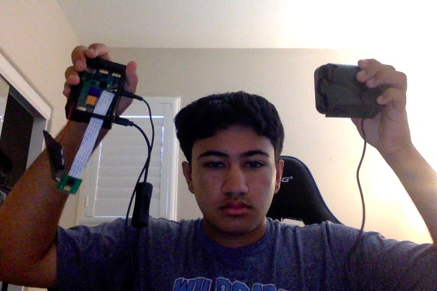

# Optical Character Recognition
For my optical character recognition project, I utilized a Raspberry Pi + PiCamera to develop an efficent device capable of converting an image of text into machine-readable text format. For instance, if you were to scan a receipt, your computer saves the scan as an image file and then uses OCR technology to read the text. This technology is especially useful for self-driving cars since it is able to read number plates and road signs.


| **Engineer** | **School** | **Area of Interest** | **Grade** |
|:--:|:--:|:--:|:--:|
| Ahdil K | Dougherty Valley | Computer Science/Data Science | Incoming Senior

**Replace the BlueStamp logo below with an image of yourself and your completed project. Follow the guide [here](https://tomcam.github.io/least-github-pages/adding-images-github-pages-site.html) if you need help.**



# Demo Night

<iframe src="https://drive.google.com/file/d/1J3SKGu2Ltg9DHNl0EGmwmocA9eEJTIrr/preview" width="640" height="480" allow="autoplay"></iframe>

  

# Final Milestone


<iframe width="560" height="315" src="https://www.youtube.com/embed/SR7ORd67jkE?si=JdpPDmQDnqgwwdRc" title="YouTube video player" frameborder="0" allow="accelerometer; autoplay; clipboard-write; encrypted-media; gyroscope; picture-in-picture; web-share" allowfullscreen></iframe>


Hello, my name is Ahdil, and this is my Milestone 3 video. For this milestone, I enhanced my base project by adding two significant features.

First, I integrated a speaker into my Raspberry Pi, enabling it to audibly read out each detected word. Initially, I encountered an issue with the speaker's low volume. After watching several YouTube tutorials, I learned that I could adjust the volume using VNC Viewer, which resolved the problem.

The second enhancement was adding an image generation feature that creates a pixelated image of the detected text. When the text is displayed on the screen, the algorithm also generates a URL for the corresponding image. You can then copy and paste this URL into Google to view the image. A challenge I faced here was finding an efficient way to generate the images. With my instructor's help, I obtained an OpenAI API key, which allowed the algorithm to run smoothly.   


# Second Milestone


<iframe width="560" height="315" src="https://www.youtube.com/embed/1VhNpJ6V-xc?si=ig2Elgns4MIzpBMB" title="YouTube video player" frameborder="0" allow="accelerometer; autoplay; clipboard-write; encrypted-media; gyroscope; picture-in-picture; web-share" allowfullscreen></iframe>

Hello, my name is Ahdil Khan, and this is my Milestone 2 video. For this milestone, I successfully set up my Ardu Raspberry PiCamera, which was shipped to me, and established a remote connection using OpenCV. After running a few commands and writing some code, I got everything up and running.

Next, I used the Picamera 2 library to process images. This involved writing code to save an image from the PiCamera to a folder, allowing me to view it through VNC Viewer. This step worked well, and I could see the area around me through the PiCamera.

One issue I encountered was figuring out how to display the camera feed on my laptop. After watching some YouTube tutorials, I learned that I needed to run the code in VSCode and execute a few commands in the VNC Viewer terminal to connect back to the code. Another challenge was the camera shutting off after a few seconds. With help from my instructor and by reviewing the code, I discovered that I needed to adjust the camera's sleep time to keep it running longer.

My next step was to enable the PiCamera to recognize text in live images. To achieve this, I created a new file with sample code provided by my instructor and executed various terminal commands. This successfully enabled the camera to recognize text.

For Milestone 3, I plan to use a speaker with my current Raspberry Pi setup to convert the recognized text into spoken words.  

# First Milestone


<iframe width="560" height="315" src="https://www.youtube.com/embed/sm7fES8VpNg?si=NbQ9KfNLbPfxW1GS" title="YouTube video player" frameborder="0" allow="accelerometer; autoplay; clipboard-write; encrypted-media; gyroscope; picture-in-picture; web-share" allowfullscreen></iframe>


For my first milestone, I set up the hardware components of my Raspberry Pi, including the case, USB wires, and power cable. One issue I encountered was installing the fan to prevent the heatsinks on the motherboard from overheating. I wasn't sure how or where to install the fan, but after watching some YouTube tutorials, I figured it out and got it working.

After setting up the hardware, I flashed the SD card with the Raspberry Pi OS and configured the Wi-Fi. I then established a remote connection to the Raspberry Pi via SSH, and with VNC Viewer, I didn't need a keyboard or mouse. Initially, I couldn't connect through VNC Viewer due to a "connection refused" error. A YouTube tutorial explained that I needed to enable the VNC server on the Raspberry Pi before connecting with the VNC Viewer, which solved the problem.

Finally, I used VS Code to write a small Python script to test if I could push code to the Raspberry Pi, and it worked successfully. My next steps are to set up the PiCamera and begin configuring the OCR software.

# Schematics 


# Code


```python
import cv2
import pytesseract
from pytesseract import Output
from picamera2 import MappedArray, Picamera2, Preview
from espeak import espeak
from time import sleep
from openai import OpenAI
import os
 
#cap = cv2.VideoCapture(0)
#cap.set(cv2.CAP_PROP_BUFFERSIZE, 1)
picam2 = Picamera2()
picam2.configure(picam2.create_preview_configuration({"size": (1024, 768)}))
picam2.start_preview(Preview.QTGL)
picam2.start()
 
i = 0
client = OpenAI(
    # This is the default and can be omitted
    
)

openai = OpenAI()


while True:
    #ret, frame = cap.read() # from the tutorial but outdated
    frame = picam2.capture_array()
 
    d = pytesseract.image_to_data(frame, output_type=Output.DICT)
    n_boxes = len(d['text'])
    #print(n_boxes)
    for i in range(n_boxes):
        if int(d['conf'][i]) > 60:
            (text, x, y, w, h) = (d['text'][i], d['left'][i], d['top'][i], d['width'][i], d['height'][i])
            # don't show empty text
            if text and text.strip() != "":
                frame = cv2.rectangle(frame, (x, y), (x + w, y + h), (0, 255, 0), 2)
                frame = cv2.putText(frame, text, (x, y - 10), cv2.FONT_HERSHEY_SIMPLEX, 1.0, (0, 0, 255), 3)
                cv2.imwrite("/home/ahdilkhan/Documents/ocr"+str(i)+".png", frame) # exact file path will vary by user
                i += 1
                print(text)
                
              
                espeak.set_voice('english')
                espeak.synth(text)
                while espeak.is_playing():
        # espeak is asynchronous, so wait politely until it's finished
                    sleep(0.25)

                prompt = text
                model = "dall-e-2"
                
    # Generate an image based on the prompt
                response = openai.images.generate(prompt=prompt, model=model, size = "256x256", quality = 'standard', n = 1)

    # Prints response containing a URL link to image
                print(response)

 
    # Display the resulting frame
    cv2.imshow('frame', frame) # only works for VNC Viewer
    if cv2.waitKey(1) & 0xFF == ord('q'):
        break

cv2.destroyAllWindows()
```


# Bill of Materials


| **Part** | **Note** | **Price** | **Link** |
|:--:|:--:|:--:|:--:|
| Raspberry Pi4 Starter Kit | Used to run the OCR part of the project | $84.99 | <a href="https://www.amazon.com/Vemico-Raspberry-Starter-Heatsinks-Screwdriver/dp/B09QGZ94M8/ref=sr_1_20?crid=3EO43F1FEOV0O&dib=eyJ2IjoiMSJ9.ualQ11OTmi8CjjOvKHbGSeoxaNIDkPpfJZtZyzHol1FvvEglqiwyyx0fx51TZiZ1aBaberSc_J42HaMFrKc4G4wzNZJZEEpXeUe5uPFLGOfeZg1JiJOFIRBWErdjcMSJmt9OiXh3fiaEklJDqjCH8YliLFrOMz2gDd9N61tXfyLELptXi2DxstQVgqAxXv9vJnZG8mc1uPn3ogYVtajj4NEvfs_J7KSsaUplZk2LAkNdh8C7VZAVCj9KGMicav_2LQeL3moiJ-zNLr78csIQdysoo0AdWn9HClXObBEGA2A.R84P9iUHYtjBbieyHy8tFMnaqBUBiYhKHI1MA9uJP1A&dib_tag=se&keywords=raspberry%2Bpi%2Bkit&qid=1716420057&s=electronics&sprefix=raspberry%2Bpi%2Bki%2Celectronics%2C105&sr=1-20&th=1"> Link </a> |
| Ardu PiCamera | To take pictures and detect the text | $6.99 | <a href="https://www.amazon.com/Arducam-Megapixels-Sensor-OV5647-Raspberry/dp/B012V1HEP4/ref=asc_df_B012V1HEP4/?tag=hyprod-20&linkCode=df0&hvadid=693620629591&hvpos=&hvnetw=g&hvrand=15006871956907933718&hvpone=&hvptwo=&hvqmt=&hvdev=c&hvdvcmdl=&hvlocint=&hvlocphy=9032043&hvtargid=pla-820020083673&mcid=75fa5b0480f739c29fa68a28d965eee9&gad_source=1&th=1"> Link </a> |
| Mini External Speaker | To say the detected text out loud | $15.49 | <a href="https://www.amazon.com/Sanpyl-External-Speaker-NSP-100-Microphone/dp/B0816F2R56"> Link </a> |


# Other Resources/Examples
One of the best parts about Github is that you can view how other people set up their own work. Here are some past BSE portfolios that are awesome examples. You can view how they set up their portfolio, and you can view their index.md files to understand how they implemented different portfolio components.
- [Example 1](https://trashytuber.github.io/YimingJiaBlueStamp/)
- [Example 2](https://sviatil0.github.io/Sviatoslav_BSE/)
- [Example 3](https://arneshkumar.github.io/arneshbluestamp/)

To watch the BSE tutorial on how to create a portfolio, click here.
